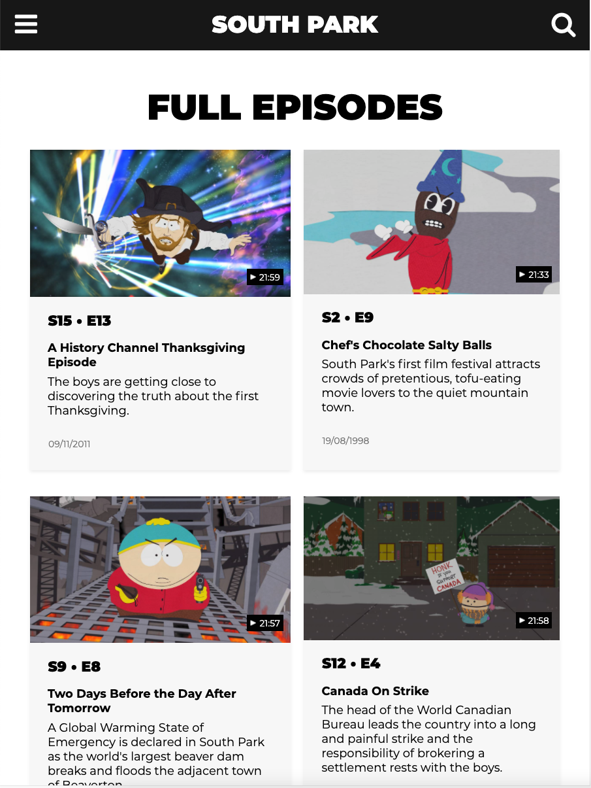
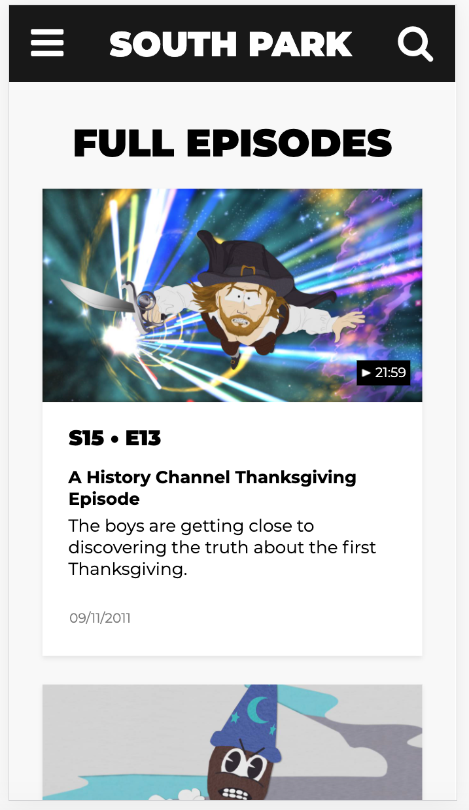
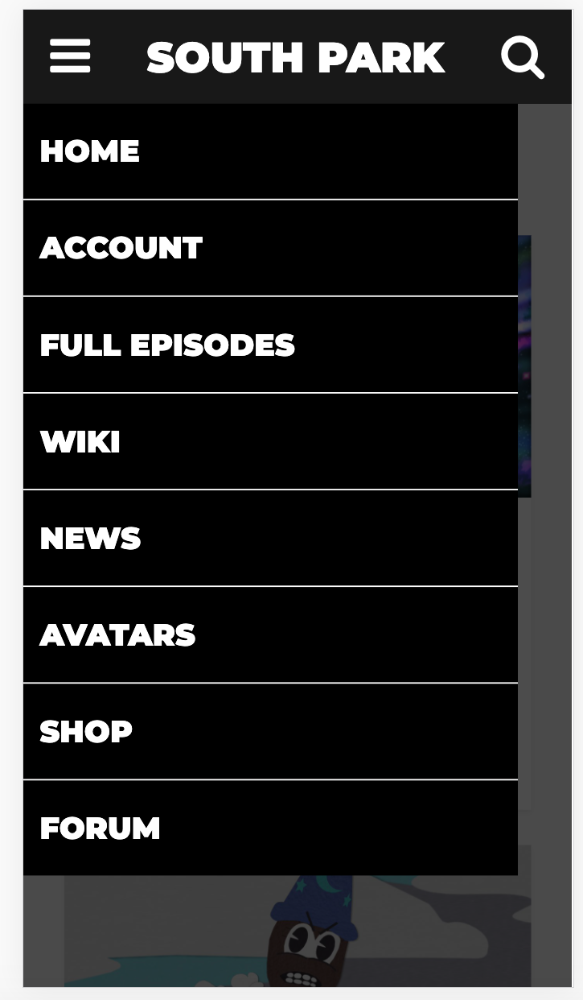
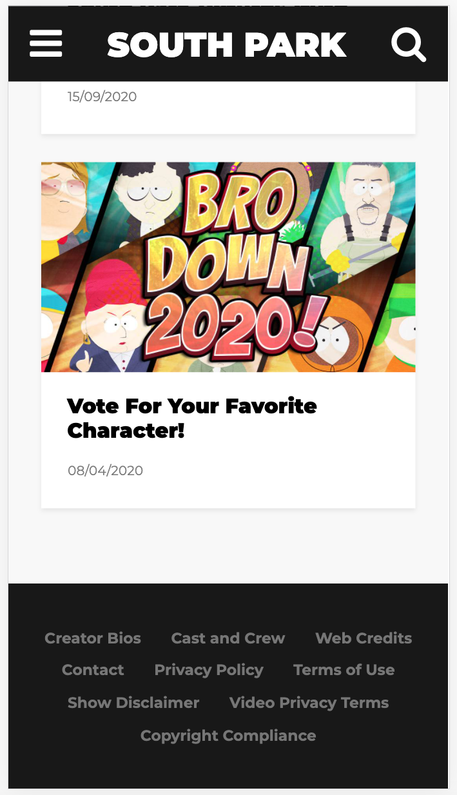

# Procesverslag
**Auteur:** -Daan Olff-

Markdown cheat cheet: [Hulp bij het schrijven van Markdown](https://github.com/adam-p/markdown-here/wiki/Markdown-Cheatsheet). Nb. de standaardstructuur en de spartaanse opmaak zijn helemaal prima. Het gaat om de inhoud van je procesverslag. Besteedt de tijd voor pracht en praal aan je website.

## Bronnenlijst
1. https://zellwk.com/blog/how-to-write-mobile-first-css/
2. https://clideo.com/
3. https://zellwk.com/blog/media-query-units/
4. https://css-tricks.com/snippets/css/complete-guide-grid/

## Eindgesprek (week 7/8)

-dit ging goed & dit was lastig-

**Screenshot(s):**

## Voortgang 3 (week 6)

### Stand van zaken

Ik ben begonnen met het toepassen van verschillende breakpoints. Voor de rest moet ik nog een vraag stellen
over mijn Javascript.

Deze les hebben we vooral gekeken naar voorbeelden en hebben we tips gekregen voor in ons eigen ontwerp.
Daarnaast stelde ik nog de vraag hoe ik mijn JavaScript op alle video's kon toepassen.
Dat kan via een forEach of een loop. Ik ben gelijk gaan kijken op het internet wat de meest toegankelijke 
manier was om dit te doen (voor de gebruiker). Ik heb dit vervolgens laten rusten om verder mee te gaan in de vakantie.

## Voortgang 2 (week 5)

### Stand van zaken

Ik heb gebruik gemaakt van een aantal divs voor de timestamps van een video. Is dit oke in verband met de semantiek?
Ik weet namelijk niet welk ander blokelement hier beter kan worden toegepast.

Daarnaast: is if/else een goede manier om hamburgermenu en search functie elkaar niet te laten overlappen? 
Dus dat er slechts één van deze twee elementen actief is?

Nu moet de footer worden afgemaakt en het grid worden geplaatst.
Bovendien moet ik de tweede pagina verder uitwerken.

**Screenshot(s):**

-screenshot(s) van hoe ver je bent met korte uitleg-

Homepage

Navigatie

Footer

**Feedback:**

-feedback van de docent:-

## Voortgang 1 (week 3)

### Stand van zaken

Het zoeken naar oplossingen gaat goed. Ik moet wel meer de vaart erin gooien.

**Screenshot(s):**

-screenshot(s) van hoe ver je bent met korte uitleg-

Homepage

Hamburgermenu

### Agenda voor meeting

-samen met je groepje opstellen-

| Dionysha       | Ashley             | Daan         | ---              |
| ---            | ---                | ---          | ---              |
| Footer         | ---                | JS hamburger | ---              |
| ---            | ---                | Semantiek    | ---              |

### Verslag van meeting

Ik ben opweg met responsive maken van de website. Er moet nog wel even gekeken worden naar fontsite (em/rem ipv px).
Daarnaast kan filter() in css worden gebruikt om een overlay te maken. Een goed idee was om wellicht in een later 
stadium te werken met SVG icoontjes voor de header in HTML.

## Breakdownschets (week 1)

## Intake (week 1)

**Je startniveau:** rood

**Je focus:** responsive

**Je opdracht:** https://www.southparkstudios.com/

**Screenshot(s) van de eerste pagina (small screen):**

**Screenshot(s) van de tweede pagina (small screen):**

